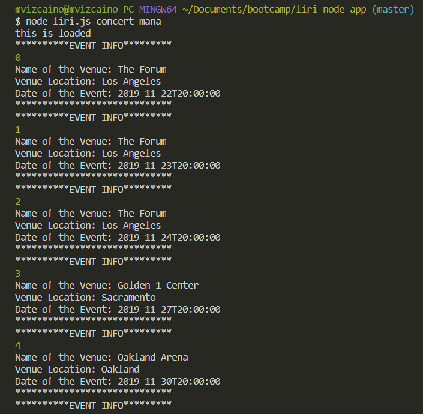
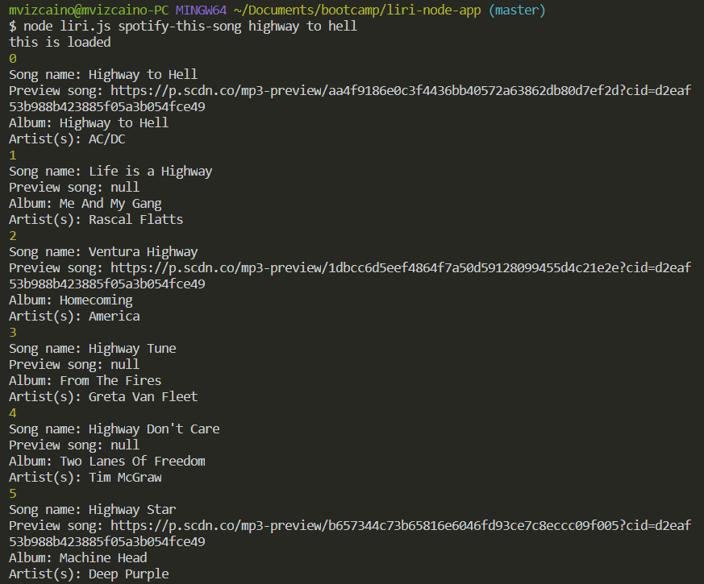
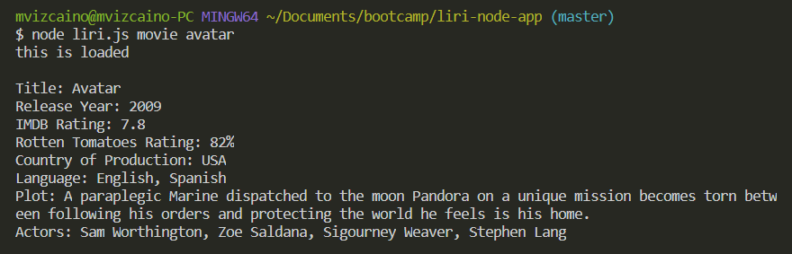
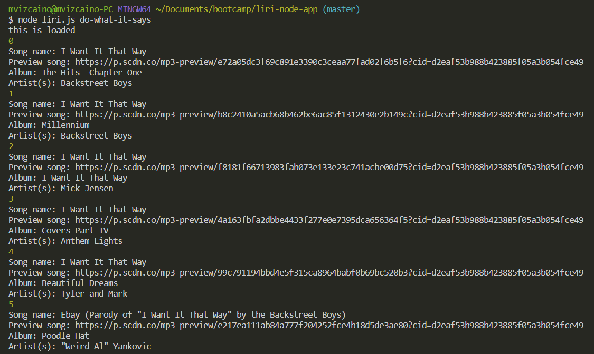

#ABOUT THE APP
LIRI is a Language Interpretation and Recognition Interface. LIRI is a command line node app that takes in parameters and gives back data. The user has the option of using four commands (listed below) in conjuntion with specific parameters associated with the commands. The Commands are:

* concert

* spotify-this-song

* movie

* do-what-it-says

## Instructions:

1. Open your terminal.

2. Navigate to the folder that contains the liri.js file.

3. call the file and the one of the four commands.

### Concert command:

    node liri.js concert <type your artist or band>

    The app will display a list of all events and locations where the artist or band will perform. The results will also get transfer in the log.txt file. See screen-shot below:

### spotify-this-song command:

    node liri.js spotify-this-song <type your song>

    The app will display a list of information associated with the song. The app will also log all the results in the log.txt file. See screen-shot below:

### Movie command:

    node liri.js movie <type your movie>

    The app will display information associated with the movie. The system will also log all the results in the log.txt file. See screen-shot below:

### do-what-it-says command:

     node liri.js do-what-it-says

    The app will read the text in the random.txt file, and perform the command listed in the random.txt file.

## Technology:

* Javascript
* Nodejs
* Node packages:
    Node-Spotify-API
    Request
    Moment
    DotEnv
* APIs used:
    Bands in Town
    OMDB
* Git
* GitHub